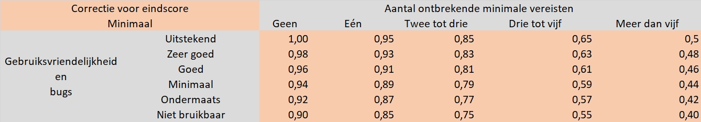

# Projectvereisten

Het project wordt in twee variaties aangeboden.
Een variatie met minimale vereisten om te slagen en een variatie met zwaardere vereisten waarmee je een hogere score kan
behalen.
De puntenverdeling (voor de 95% (januari/juni) of 100% (augustus) die op de code en verdediging staat) is als volgt:

- 85% is te verdienen door te beantwoorden aan de functionele vereisten
  - Minimale vereisten: 65%
  - Uitgebreide vereisten: 20%
- 15% is te verdienen door een kwalitatieve, complexe en grote app te schrijven

## Mondelinge verdediging

Je moet je project mondeling verdedigen tijdens de examenperiode.
Tijdens deze verdediging test je docent of je de ingestuurde code begrijpt en kunt uitleggen.
Daarnaast moet je de manier waarop je code geschreven is ook kunnen verantwoorden.

Als je niet in staat bent om een onderdeel adequaat te verklaren, kan je geen punten verdienen voor dat onderdeel, als
je (bijna) geen enkel onderdeel kunt verklaren, moeten we ervan uitgaan dat je de code niet zelf geschreven hebt en
worden de gepaste procedures opgestart.

## Toegestane hulpmiddelen

Je mag voor dit project gebruik maken van bronnen zoals tutorials, voorbeelden, StackOverflow, ChatGPT, GitHub Copilot,
...
Dit betekent echter niet dat je project hier volledig op gebaseerd is.
We controleren je inzendingen en indien grote gelijkenissen met online bronnen gedetecteerd worden, dan is dit plagiaat
en wordt een fraudeprocedure gestart.

Generative AI-tools mogen gebruikt worden, maar we verwachten dat je alle code die door deze tools gegenereerd wordt kan
verklaren.
Dit wordt dan ook afgetoetst op de mondelinge verdediging.

Het is toegestaan om delen uit de lesvoorbeelden of opgeloste oefeningen te herbruiken.
**Als je dit doet, moet je dit op een innovatieve manier doen, anders verdien je hier geen punten mee.**
As je twijfelt of jouw code voldoende verschillen vertoond met de code uit de lessen, kan je jouw docent hier natuurlijk
over contacteren.

## Begeleiding

Tijdens het bouwen van de applicatie is het toegestaan raad te vragen aan de begeleidende docent.

Vragen over leerstof die gezien is tijdens de lessen worden zelden beantwoord, je wordt meestal doorverwezen naar het
relevante lesmateriaal.
Als je echter kan aantonen dat je het cursusmateriaal gebruikt heb en geprobeerd hebt om een feature zelf te
implementeren, word je geholpen, ook als dit gaat over leerstof die wel in de les behandeld is.
Vragen over features van React/Expo/Expo Router/React Navigation die in geen enkele les of oefening gezien zijn
worden sowieso beantwoord.

Met vragen over conceptuele problemen zoals het structureren van je app of dingen die je niet geprogrammeerd krijgt,
maar die los staan van de (geziene) React/Expo/Expo Router/React Navigation features kan je altijd terecht bij
je begeleidende docent.
Je wordt echter gecoacht in het vinden van een oplossing en krijgt deze niet voorgeschoteld.

Indien er problemen ontstaan door bibliotheken die niet meer werken door updates, updates van de IDE, deprecated
features … kan je hier natuurlijk ook hulp voor vragen.

Tijdens de examenperiode van januari is er een projectweek voorzien. Tijdens deze week kan je onder begeleiding van een docent je project afwerken.

## Kwaliteit

De kwaliteit van je code wordt beoordeeld op basis van onderstaande, **niet exhaustieve**, lijst.
Omdat je voor een functionerend project al veel punten kunt verdienen (85%) wordt de kwaliteit en complexiteit van je
code streng beoordeeld.

- Naamgeving van variabelen
  - Correct gebruik van enkelvoud/meervoud in de namen
  - Duidelijke namen
- Types
  - Types van variabelen
  - Types van functies
- Gebruik van enums waar toepasbaar
- Geen diep geneste callbacks
- Gebruik van klassen/interfaces in de plaats van objecten met het any type
- Consistentie in de code, geen mix van () =&gt; {} en function() {} (voor methode namen, callbacks kunnen natuurlijk
  wel als arrow function gedefinieerd worden als de rest de klassieke syntax gebruikt.)
- Volgen van de linting regels die geconfigureerd zijn in ESLint en de stijlregels die geconfigureerd zijn voor
  Prettier (deze regels mogen aangepast worden, zolang je één bepaalde code-style aanhoud en niet alle regels op 'off'
  zet, is er geen probleem)
- Geen hard gecodeerde gegevens
- Voldoende gebruik van services
- Opsplitsen in componenten waar nuttig
- Leesbaarheid

## Minimale vereisten

Als je project voldoet aan onderstaande vereisten, kan je, op voorwaarde dat de code een minimum aan bugs en een
bruikbare UI bevat, maximaal een **13/20** scoren voor de functionele eisen.
Je kan natuurlijk nog steeds punten verdienen voor de kwaliteit van je code en zo maximaal een **16/20** behalen.
Hoe meer van deze vereisten ontbreken en hoe meer bugs er zijn, hoe lager je zult scoren.
Je eindresultaat is dus meer dan de som van je punten.
Je eindresultaat voor de minimale vereisten wordt vermenigvuldigd met één van onderstaande factoren, afhankelijk van het
aantal ontbrekende features en het aantal bugs.

Hier worden volgende definities gebruikt:

- Uitstekend: Na grondig testen geen enkele bug tegengekomen en een duidelijke UI waar alles in terug te vinden is
  zonder problemen en die steeds de juiste data weergeeft.
- Zeer goed: Na grondig testen een bug of twee gevonden en/of hier en daar een onduidelijke UI of een UI die niet goed
  bruikbaar is, maar die nog steeds de juiste data weergeeft.
- Goed: Meer dan de helft van de aanwezige functionaliteiten werken, maar vertonen bugs en/of een foute UI die niet
  altijd de juiste data bevat of UI-elementen die onbruikbaar worden.
- Minimaal: Minder dan de helft van de aanwezige functionaliteiten werken volledig en de UI vertoont regelmatig foute
  data of onbruikbare onderdelen.
- Ondermaats: Minder dan 1/3 van de functionaliteiten werken zonder bugs en/of de UI vertoont regelmatig foute data of
  onbruikbare onderdelen.
- Niet bruikbaar: Geen van de aanwezige functionaliteiten werken zonder bugs.

### Pagina’s

Voeg minstens **vier** pagina’s toe aan je applicatie, waarvan er één enkel statische gegevens mag bevatten.
Zorg dat je tussen deze pagina’s kan navigeren, hoe je dat doet (drawer, tabs, stack, top-tabs, ...) beslis je zelf.
De pagina’s mogen een combinatie van statische en hard gecodeerde data bevatten, maar minstens drie pagina's moeten
onderdelen bevatten die dynamisch opgebouwd zijn.

Een pagina is dynamisch als deze aan één of meer van onderstaande vereisten voldoet:

- Een pagina waar data op verschijnt die uitgelezen wordt uit een sqlite database, mmkv, Firebase, Supabase,
  een eigen API, een third-party API, ...
- Een pagina die invoer van de gebruiker accepteert en deze verwerkt en vervolgens doorstuurt/ bewaard in een sqlite
  database, mmkv, Firebase, Supabase, een eigen API, een third-party API, ...
- Een pagina die, op basis van de invoer van de gebruiker, data filtert en weergeeft maar de data niet aanpast.

#### Dynamische data

Om te voldoen aan de minimumvereisten moet elke dynamische pagina minstens objecten bevatten met twee of meer
attributen (**id/primary key niet meegeteld**).
Daarnaast moet minstens één pagina objecten gebruiken met zes of meer attributen (**id/primary key niet meegeteld**).

Voor bovengenoemde objecten moeten **alle** CRUD-operaties voorzien worden.
Daarnaast moet er tijdens het invoegen van nieuwe data de nodige validatie gebeuren.

### Native modules

Gebruik minsten **twee** native modules die voldoen aan één van onderstaande vereisten:

- De module maakt gebruik van een hardware functionaliteit zoals geolocation, de camera, de accelerometer, bluetooth, ...
- De module integreert met een onderdeel van het onderliggende OS (Android/iOS) zoals de contacten, de kalender, notifications, ...
- De module maakt geen gebruik van een hardware of OS-functionaliteit, maar gebruikt wel Java, Swift, C of C++ code om
  een bepaalde actie uit te voeren op de OS-laag.
  Denk hier aan sqlite, mmkv, een image editing library, een lokale AI library, ...

Indien je een native module gebruikt die we niet gezien hebben tijdens de les of een geziene module gebruikt op een
innovatieve manier, zal dat de punten voor de kwaliteit en complexiteit van je project ten goede komen.

De native module moet op een **zinvolle** manier gebruikt worden.
Een controle op de netwerkverbinding, maar verder geen gebruik maken van deze verbinding zal je geen punten opleven, ook
al werkt de code zonder fouten.
Ook native modules die je gebruikt om features die standaard aanwezig zijn te vervangen, worden niet als zinvol
beschouwd.
Denk hier aan de clipboard module, als je gewoon een knop toevoegt waarmee je tekst in een inputveld kan plakken, is dat
niet zinvol.
Als je bijvoorbeeld een copy knop voorziet waar mee een JSON-representatie van een bepaald object, bijvoorbeeld een DND
character sheet, naar het clipboard gekopieerd wordt om te delen met andere gebruikers, is dat wel zinvol.

:::caution
Niet elke library die via `pnpm install` geïnstalleerd wordt is automatisch een native modules.
Een library wordt pas als een native module gerekend als deze niet gebruikt kan worden zonder dat het
`pnpm expo prebuild` commando nodig is of als deze deel uitmaakt van de
[Expo SDK](https://docs.expo.dev/versions/latest/).

Onderstaande libraries of onderdelen van libraries tellen **niet** mee:

- react-native-svg
- @expo/vector-icons
- react-native-reanimated
- react-native-gesture-handler
- react-native-safe-area-context
- expo-system-ui
- @shopify/flash-list
- expo-splash-screen

Contacteer je docent bij twijfel.

:::

Voor inspiratie kan je volgende bronnen raadplegen:

- [React Native Directory](https://reactnative.directory/)
- [Expo SDK](https://docs.expo.dev/versions/latest/)

### Gestures & animaties

Voeg minstens **één** gesture en animatie toe aan je applicatie.
Dit kan een swipe, pinch, double tap, long press, ... zijn, je moet het niet ver gaan zoeken.
Een long-press om een item te selecteren in een lijst kan al voldoende zijn.

Het is **niet** toegestaan om de gestures/animaties uit het lesvoorbeeld over te nemen zonder aanpassingen.

### Online services

Je moet minstens **één** online service gebruiken.
Dit kan een API, Firestore, Firebase Authentication, Firebase Storage, Supabase, Supabase Storage, Supabase
Authentication, AppWrite, een API in Next.js, ... zijn.

Natuurlijk moet dit opnieuw op een zinvolle manier gebeuren.
User authentication heeft, als je verder geen gebruik maakt van de gebruikersnaam, het e-mailadres, het GSM-nummer of
andere user gegevens, geen zin.
Een foto uploaden naar een blob storage service en vervolgens de foto enkel uit het lokale filesystem uitlezen heeft ook
geen zin.

### Logo & Splash

Zorg dat je applicatie een gepast logo en splash screen heeft.
Je wordt **niet** beoordeeld op de kwaliteit van je icoon en/of splash screen, enkel op de aanwezigheid.
De enige voorwaarde is dat de gebruikte afbeeldingen moeten verschillen van diegene die gebruikt werden in de les en van
diegenen die standaard aanwezig zijn in een Expo project.

### Publicatie

Je bouwt een **ondertekende** APK voor je applicatie
(zie les 7), **download** de APK en voeg deze toe aan je git repository.
Een link naar EAS wordt niet geaccepteerd aangezien deze verlopen en dus eventueel niet meer geldig zijn als het project
verbeterd wordt.

### Persistentie

Je app moet dynamische gegevens bevatten waarvoor CRUD-operaties voorzien worden.

Dit betekent dat de gebruiker wijzigingen moet kunnen aanbrengen en dat deze wijzigingen bewaard worden en nog
beschikbaar zijn als de app opnieuw opgestart wordt.

Hoe je dit doet, bepaal je zelf, je kan gebruiken maken van MMKV, een embedded SQLite database, een SQL-database op
Supabase, een document database Firebase, een eigen geschreven API, een SQLite database gehost via
[Turso](https://turso.tech/), ...

## Uitgebreide vereisten

Als je project voldoet aan onderstaande vereisten, kan je, op voorwaarde dat de code een minimum aan bugs en een
bruikbare UI bevat, maximaal een 17/17 halen voor de functionele eisen.
Je kan natuurlijk nog steeds extra punten verdienen voor de kwaliteit van je code en zo maximaal een 20/20 scoren voor
dit project.

**Alle minimale vereisten blijven nog steeds gelden.**

### Pagina’s

Alle **vier** de pagina’s in je applicatie moeten **dynamische** gegevens bevatten.

### Native modules

Gebruik minsten **drie** native modules.

### Online services

Gebruik **drie** verschillende online services die daarbovenop niet door hetzelfde bedrijf aangeboden worden.
Het is dus niet toegestaan om drie verschillende services van Firebase/Supabase te gebruiken, maar wel om één van deze
twee te combineren met een andere online service.

### Persistentie

Je app moet de gebruiker de optie bieden om de gegevens in de **cloud** te bewaren.
Hiervoor moet **user authenticatie** voorzien worden zodat gegevens **per gebruiker** bewaard worden.

Dit betekent niet dat de gebruiker noodzakelijk ingelogd moet zijn om de app te gebruiken.
Je kan er ook voor kiezen de gebruiker pas te laten inloggen als hij aangeeft dat de gegevens in de cloud bewaard moeten
worden en anders een local database gebruiken.

De user authentication en cloud opslag tellen mee als twee van de drie cloud services.

## Puntenverdeling

Onderstaande tabel geeft de puntendeling weer voor de minimale en uitgebreide vereisten.
Deze percentages zijn afgerond en tellen dus niet exact op tot 100%.
Voor meer informatie over de 15% die je kan verdienen met een kwalitatieve, complexe en grote app, verwijzen we naar de
informatie die we [hierboven](#kwaliteit) besproken hebben.

|                      | Minimale vereisten (65%) | Uitgebreide vereisten (20%) |
| -------------------- | ------------------------ | --------------------------- |
| Aantal pagina's      | 13.51%                   | 7.14 %                      |
| Native modules       | 21.62%                   | 28.57%                      |
| Online services      | 21.62%                   | 35.71%                      |
| Publicatie           | 10.81%                   | N/A                         |
| Persistentie         | 21.62%                   | 28.57%                      |
| Logo & Splash        | 5.40%                    | N/A                         |
| Gestures & animaties | 5.40%                    | N/A                         |
